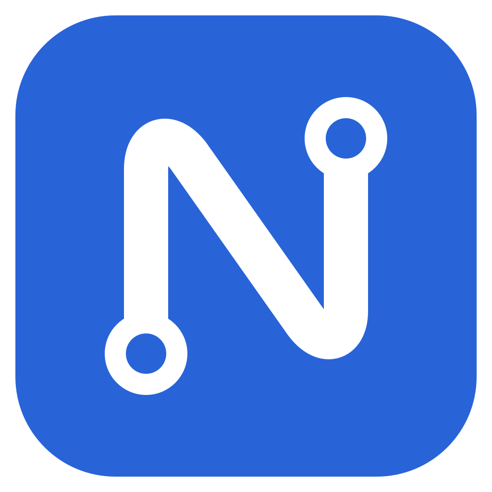

<p align="center">
  
</p>

# Net Test

Net Test is a cross-platform desktop network diagnostics application built with
Go and [Wails](https://wails.io/). Its interface uses React and TypeScript and
runs inside the operating system's native webview.

The current application supports HTTP and HTTPS endpoint testing. TCP, ICMP,
and DNS tests are planned for future releases.

## Current status

The Wails application is under active development in `wails-http/`. The current
version is an HTTP/HTTPS desktop application rather than a complete release of
the planned network-testing suite.

Current functionality:

- Run multiple HTTP or HTTPS tests using GET, PUT, or PATCH.
- Select HTTP or HTTPS separately from the URL input. HTTPS is the default.
- Configure the probe interval and request timeout.
- Define successful responses using HTTP status groups or exact status codes.
- Connect directly or through an optional authenticated HTTP/HTTPS proxy.
- Verify target and proxy TLS certificates with the operating system trust
  store.
- Start, stop, rerun, search, filter, and permanently delete tests.
- Select any part of a test row to show that test's details and graph.
- View live response time, average latency, failure rate, and probe count.
- Inspect recent responses and open a graph in a separate desktop window.
- View the complete timeline from the test's start through its latest result.
- Zoom with two timeline handles and reset to the complete timeline.
- Pause graph updates while the test continues collecting and saving results.
- Save every completed probe automatically in a local SQLite database.
- Restore saved tests and complete timelines after restarting the application.
- Browse saved History with search, status filters, and pagination.
- Export every saved probe for a test to CSV.

## Planned functionality

The following test types will be added after the HTTP/HTTPS application is
stable across the supported desktop platforms:

- **TCP tests** for checking connections to a host and port.
- **DNS tests** with selectable UDP or TCP transport and custom DNS servers.
- **ICMP tests** with platform-specific permission and compatibility handling.

These protocols will reuse the current session lifecycle, automatic storage,
History, CSV export, and timeline graph components.

## Build and install

See the [Build and installation guide](BUILD_AND_INSTALL.md) for numbered
macOS, Windows, and Linux setup, build, installation, and test instructions.

## Data and privacy

Tests and probes are stored automatically in a fresh SQLite database under the
current user's configuration directory:

```text
nt-wails/results.db
```

There is no automatic probe-count retention limit. Results remain until the
user deletes the saved test. The graph loads indexed time ranges and compact
overview data so it does not need to load an entire long-running test into each
window.

Proxy passwords are used only for the running test. They are not returned to
the frontend, written to SQLite, or included in CSV exports. A password must be
entered again when rerunning a saved test that used authenticated proxy access.

## Project structure

```text
wails-http/
  main.go                    Wails application and desktop service
  Makefile                   Repeatable setup, build, run, and test commands
  internal/ping/
    runner.go                HTTP session lifecycle and network probes
    store.go                 SQLite persistence, timeline queries, and CSV data
  frontend/
    src/App.tsx              HTTP form, test table, History, and desktop actions
    src/LatencyChart.tsx     Live and saved timeline graph
    src/useSessions.ts       Session, event, and selected-test state
    src/api.ts               Typed Wails desktop API wrappers
    src/style.css            Dark blue application design
docs/
  architecture/              Architecture and implementation decisions
  api_reference/             Desktop method contracts and call flows
```

More detail is available in the
[architecture documentation](docs/architecture/http-wails-prototype.md) and
[desktop API reference](docs/api_reference/http-wails-prototype.md).

## License

This project is licensed under a **Personal-Use License**:

- Free for individuals for personal, educational, or hobby use.
- Organizational or commercial use, including businesses, institutions, and
  government, requires a commercial license.

For commercial licensing, contact
[dennis.jian@packetstreams.net](mailto:dennis.jian@packetstreams.net).

See [LICENSE](LICENSE) for the full terms and conditions.
