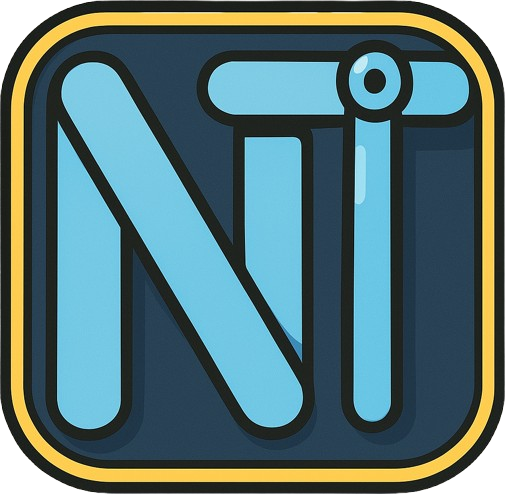

<p align="center">
  
</p>

# nt_gui

**nt_gui** is a cross-platform network diagnostics tool developed in Go, featuring a graphical user interface (GUI) built with the [Fyne](https://fyne.io) toolkit. It offers a suite of network testing utilities, including ICMP, TCP, DNS, and HTTP pings, along with result visualization and export capabilities.

## Features

- **ICMP Ping**: Test network reachability using standard ICMP echo requests.
- **TCP Ping**: Check the availability of specific TCP ports on target hosts.
- **DNS Ping**: Resolve domain names and measure DNS query response times.
- **HTTP Ping**: Send HTTP requests to endpoints and monitor response metrics.
- **Result Visualization**: View test results through interactive charts and graphs.
- **History Management**: Access and analyze past test results.
- **CSV Export**: Export test data for external analysis or record-keeping.

## Screenshots

### Main Dashboard


### Test Result & Chart


## Downloads

Precompiled executables for **Windows**, **Linux**, and **macOS** are available on the [Releases page](https://github.com/djian01/nt_gui/releases).

## Installation (from source)

### Prerequisites

- [Go](https://golang.org/dl/) 1.16 or later
- [Fyne CLI](https://developer.fyne.io/started/packaging) (optional, for packaging)

### Option 1: Build using Go

1. **Clone the Repository**:
   ```bash
   git clone https://github.com/djian01/nt_gui.git
   cd nt_gui
   ```

2. **Build the Application**:
   ```bash
   go build -o NTGUI.exe
   ```

3. **Run the Application**:
   ```bash
   ./NTGUI.exe
   ```

### Option 2: Package using Fyne

1. **Install the Fyne CLI** (if not installed):
   ```bash
   go install fyne.io/fyne/v2/cmd/fyne@latest
   ```

2. **Package the App**:
   ```bash
   fyne package -name "NTGUI" -appID "com.djian.ntgui" -appVersion 1.0.4
   ```

3. The output will be a platform-native bundle (e.g., `.app`, `.exe`, or a package installer).

### Option 3: Download Executable from Releases

Go to the [Releases](https://github.com/djian01/nt_gui/releases) page and download the appropriate package for your OS.

#### On **Windows**:
1. Download `ntgui_windows_amd64_<version>.zip`
2. Unzip it and place the `/NTGUI` folder in your preferred location
3. Run `NTGUI.exe` inside the folder

#### On **Linux**:
```bash
mkdir -p ~/NTGUI
cd ~/NTGUI
tar -xf /<parent folder of the downloaded file>/ntgui_linux_amd64_<version>.tar.xz
make user-install
```

## Usage

All test history data is stored in a local **SQLite** database automatically. This allows you to review, analyze, and export historical results even after restarting the application.

Upon launching the application:

1. **Select a Test Type**: Choose from ICMP, TCP, DNS, or HTTP ping tests.
2. **Configure Parameters**: Enter target addresses, ports, or URLs as required.
3. **Initiate Test**: Click the "Start" button to begin the network test.
4. **View Results**: Monitor real-time results displayed in the GUI.
5. **Analyze Data**: Use the history and analysis features to review past tests.
6. **Export Data**: Save results in CSV format for further analysis.

## Project Structure

- `UI_main.go`: Entry point and main GUI setup.
- `ICMP_Ping_UI.go`, `TCP_Ping_UI.go`, `DNS_Ping_UI.go`, `HTTP_Ping_UI.go`: UI components for respective tests.
- `ICMP_Ping_Func_Struct.go`, `TCP_Ping_Func_Struct.go`, `DNS_Ping_Func_Struct.go`, `HTTP_Ping_Func_Struct.go`: Backend logic for network tests.
- `Result_Analysis_UI.go`, `Result_Analysis_Func.go`: Components for result analysis and visualization.
- `History_UI.go`, `History_Func_Struct.go`: Manage and display test history.
- `Function_CSVExport.go`: Handles exporting results to CSV files.
- `assets/`: Contains application assets like icons and images.
- `pkg/`: Additional packages and modules used in the application.

## Dependencies

- [Fyne](https://fyne.io): GUI toolkit for Go.
- Standard Go libraries for networking and file operations.

## License

This project is licensed under a **Personal-Use License**:

- Free for individuals for personal, educational, or hobby use.  
- Organizational or commercial use (including businesses, institutions, and government) requires a **commercial license**.  

To obtain a commercial license, please contact:  
[dennis.jian@packetstreams.net]

See the [LICENSE](LICENSE) file for full terms and conditions.
