# NET-Test v2.0.0 desktop API

These are Wails-bound local Go methods, not network endpoints. `frontend/src/api.ts` calls `main.TestService.<Method>` through `Call.ByName`; `main.go` registers the service. All paths below are within `desktop/`. The service and event names are protocol-neutral so later test types can use the same desktop bridge.

## Methods

| Method | Request | Response | Frontend consumer |
| --- | --- | --- | --- |
| `Start` | HTTP, single-resolver DNS, single-target TCP, or single-target ICMP `Config` | Running `Session`; durable only when recording is on; validation/storage/capacity error | `App.tsx: start` |
| `StartDNS` | DNS `Config`, newline-separated resolver IPs | Running `Session[]`; validates all inputs and capacity before starting; failed batch is rolled back | `DNSTest.tsx: DNSForm.submit` → `App.tsx: onStart` |
| `StartTCP` | TCP `Config`, newline-separated IPs/hostnames | Running `Session[]`; all targets validated/resolved first, atomic capacity-checked start | `TCPTest.tsx: TCPForm.submit` → `App.tsx: onStart` |
| `StartICMP` | ICMP `Config`, newline-separated IPv4 addresses/hostnames | Running `Session[]`; validate and resolve every target before atomic capacity-checked start | `ICMPTest.tsx: ICMPForm.submit` → `App.tsx: onStart` |
| `Record` | Running HTTP, DNS, TCP, or ICMP ID | Updated `Session`; enables recording for future probes only | `App.tsx: chart Record action` |
| `Dismiss` | Stopped DNS, TCP, or ICMP ID | Void; removes current row and closes chart, retains saved history | `App.tsx: shared table Close action` |
| `Restart` | ID, proxy password string (empty if unused) | New running `Session` retaining recording preference; original run is preserved | `App.tsx: restart / runAgain` |
| `List` | Endpoint search, filter (`all`, `running`, `stopped`, `current`, `current-http`, `current-dns`, `current-tcp`, `current-icmp`), before cursor (0 initially) | `Page`: up to 50 sessions newest first, next cursor (0 at end), active count | `useSessions.ts: useSessions` |
| `Get` | ID | `Detail`: current `Session` and up to six recent raw samples, oldest first | `useSessions.ts: selection effect` |
| `Timeline` | ID, inclusive from/to Unix milliseconds (0 means default bound) | `Timeline`: ordered representative samples, exact count/succeeded/average/maximum, range, revision, aggregated flag | `LatencyChart.tsx: range effect` |
| `Stop` | ID | Stopped `Session`; durable only when recorded, otherwise memory-only; storage/not-found error | `App.tsx: stop` |
| `Remove` | Stopped ID | Void; closes an unrecorded temporary test or permanently deletes recorded history | `App.tsx: deletion dialog` |
| `ExportCSV` | ID | Saved file path, empty string on dialog cancellation, or error; exports recorded probes only | `App.tsx: chart export action` |
| `ImportCSV` | Native CSV file selection | New stopped imported `Session`; null on cancellation; validation/storage error. Stop active tests first. | `App.tsx: import action` |
| `ExportChart` | ID and PNG data URL for the visible chart | Saved PNG path, empty string on cancellation, or validation/file error | `LatencyChart.tsx: PNG export`, `App.tsx: export callback` |
| `OpenChart` | ID | Void; opens/focuses a native chart window | `App.tsx: chart actions` |

The previous `Get` complete-history transfer has been replaced by `Timeline` range queries. `List` is now paginated. `Restart` requires re-entry of a previously used proxy password. These contracts change together with the only bundled frontend consumer.

## Models

`Config` with `type="http"`: complete HTTP/HTTPS `url`, `method` (GET/POST/PUT/PATCH), `intervalMs` and `timeoutMs` (at least 1000 and no larger than Go's signed 64-bit duration in milliseconds), optional `followRedirects` (false by default), `acceptedStatuses` (one to twenty status groups 2xx–5xx or codes 200–599), and `proxy` (enabled, HTTP/HTTPS URL, username, password). Redirect following uses the standard ten-redirect limit and the same overall request timeout. Returned/saved configurations always redact the proxy password. TLS verification is mandatory; no user headers or request bodies are supplied. `recording` controls persistence and defaults to false in the new-test form, matching DNS. Missing `type` retains the legacy HTTP API/database contract: recording is on, even if an older snapshot included `recording:false` before the option was implemented. No saved database data is rewritten.

`Config` with `type="dns"`: `resolver` (IPv4/IPv6 address, no hostname or custom port), non-empty `query`, `protocol` (`udp` by default or `tcp`), positive whole-second `intervalMs`/`timeoutMs` (UI defaults 1000/4000), and `recording` (false by default). HTTP-only options are cleared. `url` is a generated resolver/query display and search string, not a network URL.

`Session`: optional DNS/TCP/ICMP `index` (per-process row number), ID, sanitized config, running, startedAt, nullable endedAt, monotonic revision, sent/succeeded counts, successful-response minRtt/maxRtt/avgRtt, nullable last sample, endReason (empty while running; stopped/interrupted/storage_error/imported), saveError, passwordRequired, and optional importNote explaining missing source metadata. All RTT values are milliseconds. Dates in models are RFC3339; timeline bounds use Unix milliseconds. Eight active tests maximum; no historical session/probe retention cutoff.

`Sample`: one-based sequence, time, RTT, statusCode (0 for no HTTP response), optional responsePhase (HTTP reason phrase), success, error. DNS adds `dnsResponse` (comma-separated IPv4 addresses) and `dnsRecord` (A/CNAME). DNS/TCP chart metadata and CSV use zero-based sequences to match legacy; the shared internal sequence remains one-based. Sequence counts completed probes; unrecorded raw samples are memory-only. A storage-failed or explicitly cancelled probe is not counted as saved.

`Timeline` statistics refer to the entire selected raw range, not just representative points. Overview samples retain actual first/last/min/max/failure representatives. Requests are read within one database transaction; revisions identify their saved snapshot. Dense representative output is bounded by the bucket decomposition; recorded raw samples remain on disk; unrecorded charts use an in-memory SQLite store. Zoom far enough to receive individual samples.

## Events

| Event | Payload | Producer | Consumers |
| --- | --- | --- | --- |
| `test:updated` | Session with latest sample and revision | `runner.go: emitLocked` → `main.go: App.Event.Emit` | `useSessions.ts: merge`, `App.tsx`, `LatencyChart.tsx` |
| `test:removed` | ID | `main.go: TestService.Remove` after successful deletion | `useSessions.ts: removal listener` |

The runner emits updates on start, committed samples, enabling recording, closing a DNS/TCP row, stop, and saving failure. Consumers reject stale revisions. List/detail subscriptions reconcile events that arrive while the initial query is in flight. Timeline requests discard responses belonging to obsolete ranges. Recent probe buffers contain at most six samples; no raw full-history polling occurs.

## Start and save flow

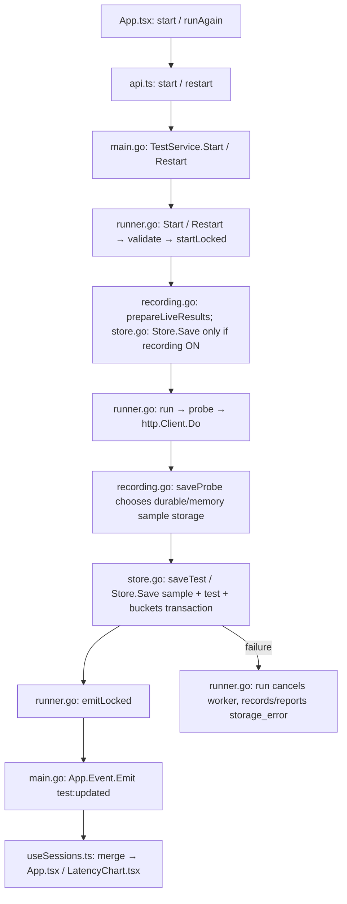

## History and timeline flow

`App.tsx: App` uses the existing `List(search, filter, before)` contract with `current-http`/`current-dns`/`current-tcp`/`current-icmp` for Tests and `stopped` for History. Search and pagination stay scoped to that tab. The `current` filter adds app-session membership; method signatures and response fields are unchanged.

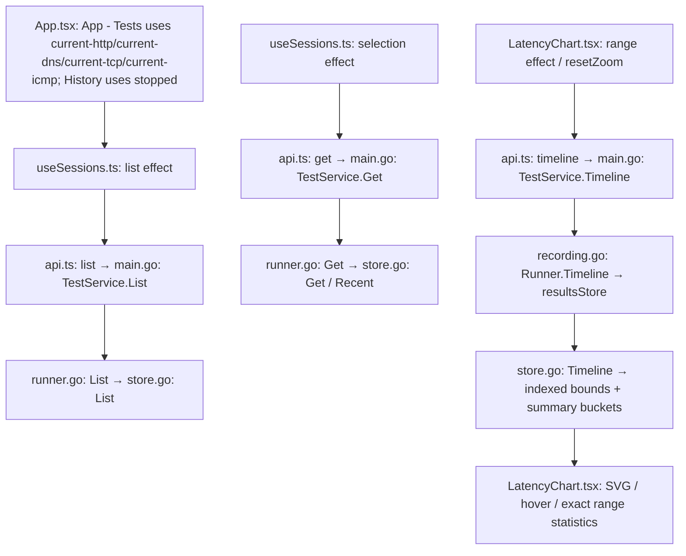

## Export and deletion flow

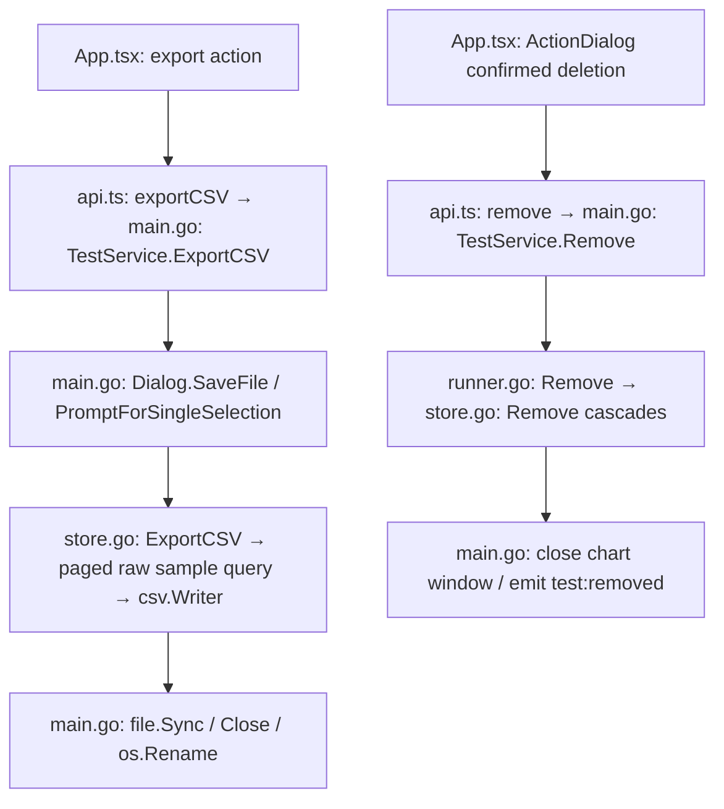

## Startup and shutdown flow

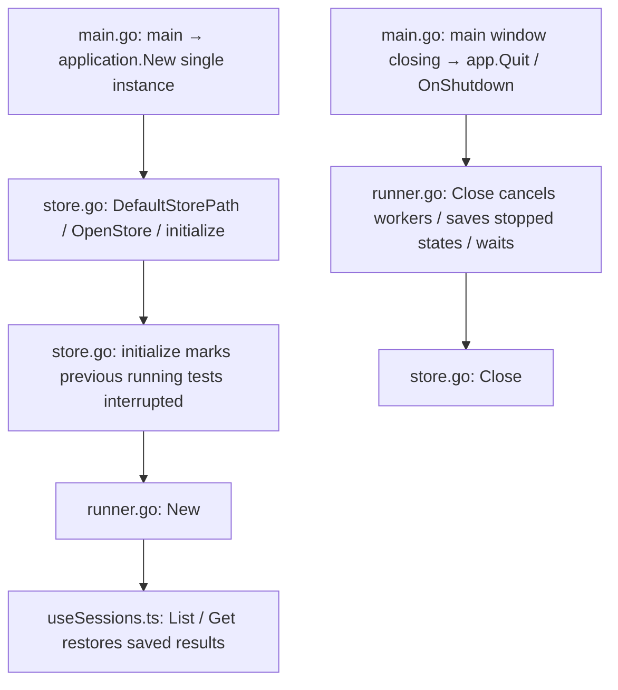

No network tests automatically resume on startup. No legacy database is opened, imported, or upgraded. Explicit HTTP/DNS/TCP/ICMP CSV import is supported independently of the legacy database.

## CSV analysis, chart image, and bulk history flows

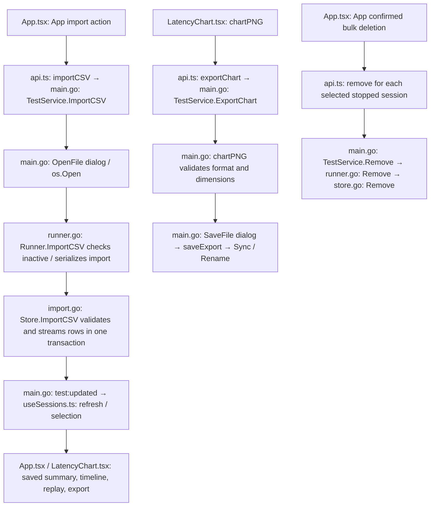

CSV import creates a separate stopped history entry and never starts network requests. The parser supports desktop HTTP/DNS/TCP/ICMP exports and legacy HTTP/DNS/TCP/ICMP exports; malformed input rolls back without a partial history entry. Imports are bounded to 256 MiB and one million rows. CSV formats without replay settings cannot fully reconstruct the original configuration; the import documents available defaults/inferences. Import requires no active tests so its transaction cannot delay live probe saving.

Chart export saves the visible plot as PNG, including chart labels and range statistics. The bridge accepts PNG data only, at most 12 MiB encoded, dimensions no larger than 4096 per axis and 12 million pixels. CSV and PNG exports both finish a temporary file before replacing the user-selected destination. Cancellation returns no path and writes no output.

Bulk deletion uses existing single-test methods and confirmation: each successful deletion persists immediately; a failure is reported with remaining selections available for retry. It is not an all-or-nothing batch API.

## Current app session list

`List(search, "current", before)` returns running and stopped tests started by this app process, with the existing 50-row pagination, URL search, and active count. `List(search, "stopped", before)` still returns all saved stopped tests, including those also visible in HTTP Tests. No response fields change. Stopping preserves the selected results. History deletion remains permanent. DNS Close uses Dismiss and retains history. CSV imports remain History-only. Closing the app discards temporary tests and current-list membership; reopening starts with an empty HTTP Tests list and retains saved History.

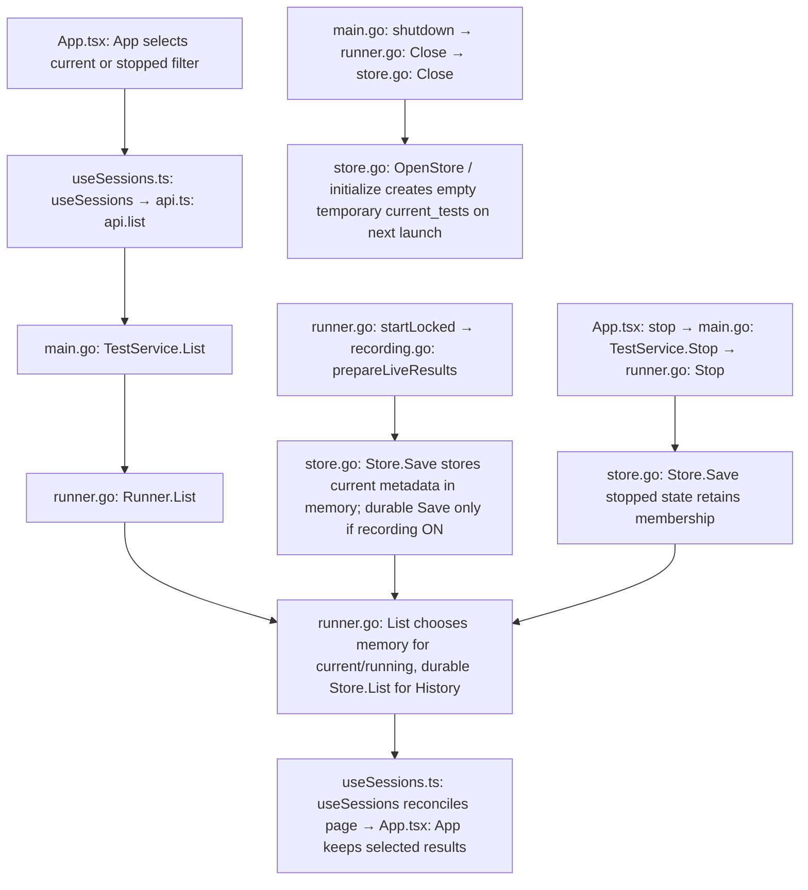

## DNS flows

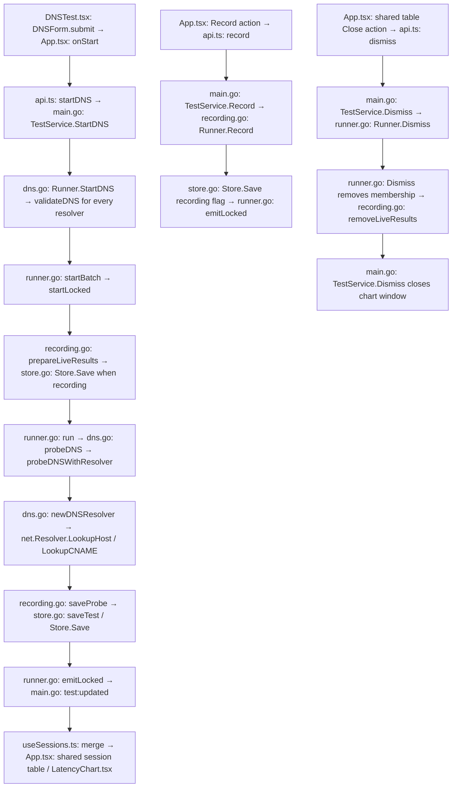

The existing eight-active-test desktop limit applies across HTTP, DNS, and TCP. Blank lines are skipped; each resolver starts a separate test. Duplicate resolver lines remain separate tests, as in legacy. Resolver validation does not perform hostname lookups. Stop cancels in-flight DNS lookups; replay preserves resolver, query, protocol, interval, timeout, and current recording preference.

Recording off saves nothing to the SQLite file: no session metadata, summary/latest snapshot, raw probe rows, or buckets. The test never appears in History. All current state stays in memory. Live raw probes and chart buckets are memory-only and are released on row close, history deletion, or app exit. Turning recording on is one-way and writes only subsequent probes to the durable store. The current chart retains earlier live probes until closed; reopened history and CSV contain only recorded probes. A failed durable save rolls back the pending live-chart transaction. No schema migration is introduced.

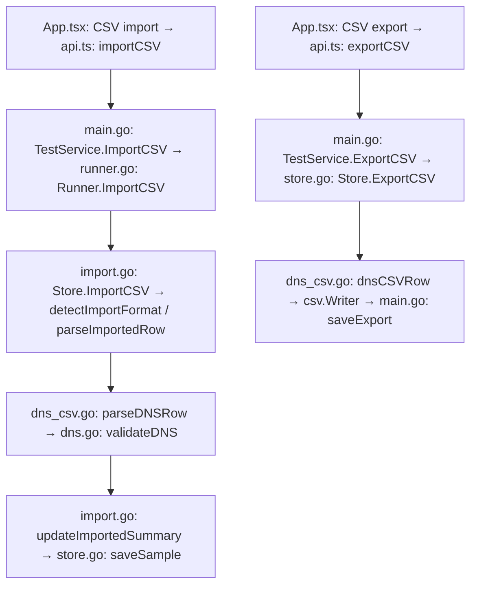

DNS export retains the 18 legacy columns, appending `Test ID`, `Interval (ms)`, `Timeout (ms)`, and `Time (UTC)` for replay fidelity and timestamp precision. Import accepts both layouts. Legacy replay defaults to 1-second interval, 4-second timeout, and recording on; query/resolver/protocol come from the file. Partial recordings may start at any non-negative sequence; consecutive rows are renumbered internally and summary statistics cover imported rows only. The UI offers DNS CSV export after stopping a recorded test, matching legacy. No raw recording means export returns a clear error.

## Shared HTTP/DNS/TCP recording

All new-test forms default recording to off. HTTP sends `type="http"` explicitly so its checkbox overrides the legacy always-record behavior. `Record(id)` accepts any running protocol and returns the updated session; it cannot turn recording back off. Replay preserves an explicit recording preference. Missing-type HTTP history and CSV imports remain recorded/replayable for compatibility.

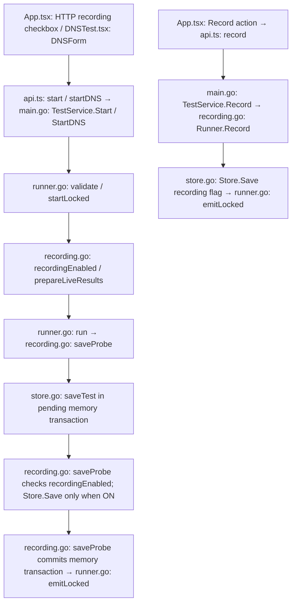

HTTP CSV import now accepts a consecutive recording beginning after probe 1, renumbers it for analysis, and labels it as a partial recording. The existing HTTP CSV columns remain unchanged. The original full-run statistics are kept in saved session metadata; imported statistics are recalculated from the recorded rows. Unrecorded HTTP, DNS, and TCP tests have no History entry and no durable metadata or samples; their entire state disappears on close or app exit.

## Recording OFF: no durable data (2026-09-10)

This supersedes the earlier behavior that saved unrecorded session summaries. All test types use the same rule: `recording=false` means no writes to the persistent SQLite file, including on Start, completed probes, Stop, replay, close, error handling, and shutdown. An in-memory SQLite store provides the existing indexed/paginated current-session and chart behavior without a disk-backed database for these tests. Record ON begins durable persistence; earlier raw probes are not backfilled.

`List(current/current-http/current-dns/current-tcp/running)` queries in-memory current summaries for recorded and unrecorded tests; `List(stopped/all)` queries recorded persistent History. Old explicitly unrecorded summaries written by prior builds are excluded from History without destructive cleanup. Missing-type legacy HTTP entries remain recorded for compatibility.

`Get`, `Restart`, `Stop`, `Remove`, `Dismiss`, and `ExportChart` work for temporary tests through their memory state. Closing a stopped unrecorded HTTP row is immediate; DNS Close also drops its temporary state. Recorded History deletion retains confirmation. API method signatures and schema version are unchanged.

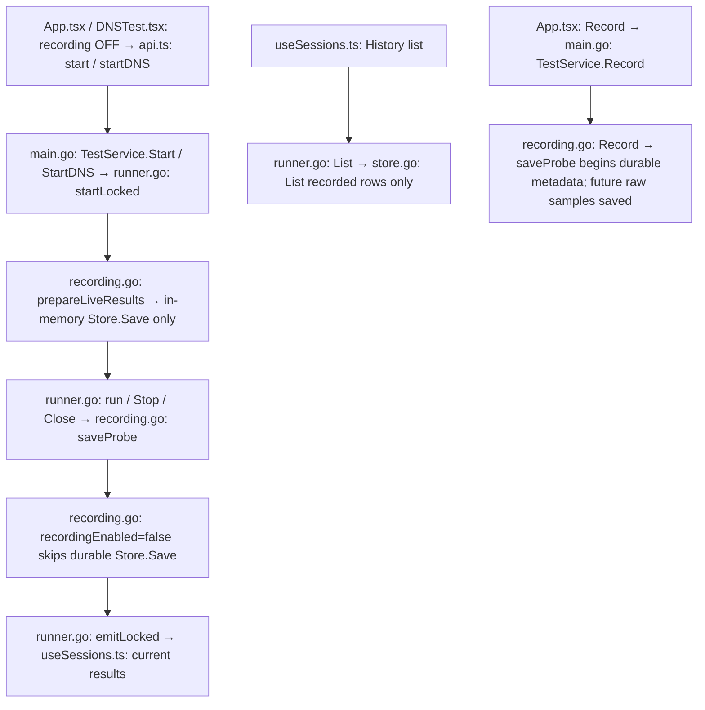

## TCP API and flows

Wails bridge endpoint `main.TestService.StartTCP(config, targets)` accepts a
newline-separated list of IPs/hostnames and `Config` with `type="tcp"`, `port`
(1–65535), `intervalMs`/`timeoutMs` (positive whole seconds in milliseconds),
and `recording`. The form defaults to 1000/4000ms with recording off. `Start`
also accepts a single TCP config with `target`. The backend normalizes TCP
configs, clearing HTTP/DNS fields, generating `url` as host:port for search,
and populating `resolvedIP`. Each hostname lookup is limited to the smaller
of the configured timeout and ten seconds. StartTCP ignores any supplied
resolvedIP and resolves each listed target. Duplicate lines are separate tests.
The batch limit and total active limit are eight. Responses return normalized
`Session[]` with independent TCP indices, or validation/resolution/capacity/storage
errors with no partially running batch. TCP uses the existing `Sample` fields.

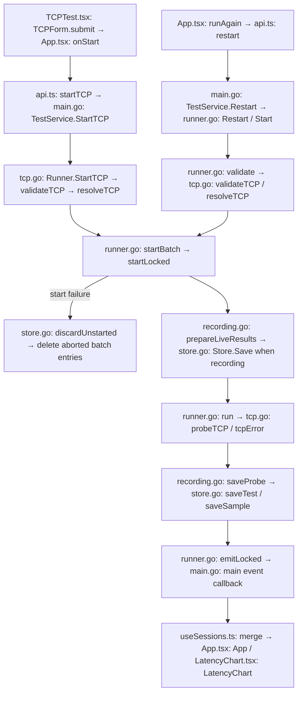

`Restart` preserves target, port, pinned IP, timing, and current recording state.
It loads a snapshot before resolving, so a legacy hostname lookup does not hold
the runner lock. `Stop` cancels the current connection without counting it as a
failed probe. `Record` enables durable saving for future probes only.
`List(search, "current-tcp", before)` returns only current TCP rows with the
existing 50-row cursor pagination. `Get`/`Timeline` return shared details and
range statistics. `Dismiss` accepts stopped DNS or TCP rows, releases their live
state, and retains saved History; `Remove` deletes recorded History explicitly.

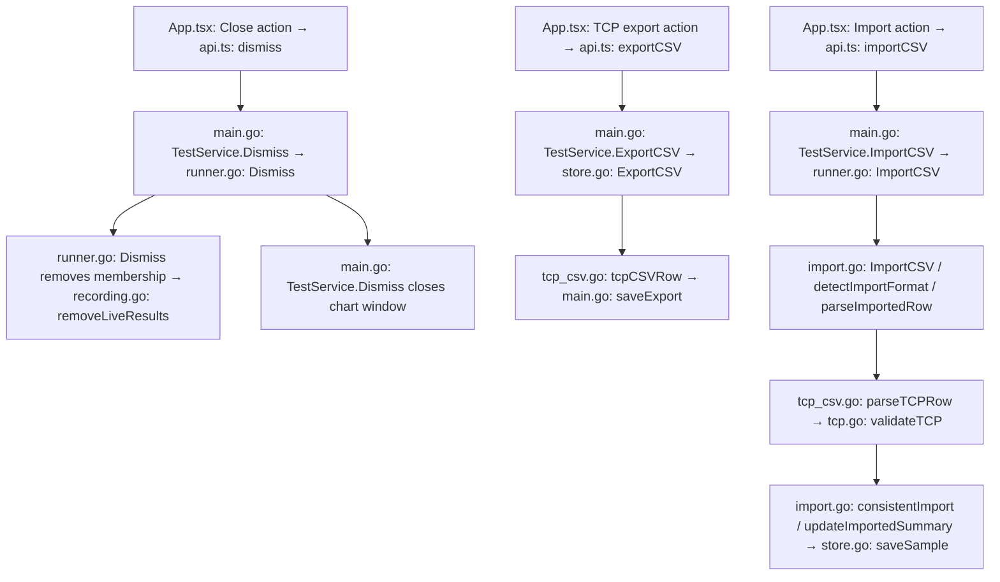

TCP CSV supports legacy's 17 columns (`Type` through `AdditionalInfo`), plus four
desktop columns (`Test ID`, `Interval (ms)`, `Timeout (ms)`, `Time (UTC)`).
Exports use zero-based probe sequence numbers and preserve nanosecond timestamps.
Imports accept partial consecutive recordings, produce a separate stopped
History entry, and recompute statistics from imported rows. No network lookup
occurs during import. Legacy defaults are 1s interval, 4s timeout, recording on;
a legacy hostname in DestAddr is resolved only when replayed. Unknown destination
addresses, nonzero payloads, malformed rows, and changing metadata roll back the
whole import. The shared 256 MiB/one-million-row limits remain in place.

## ICMP contract and call flow

Local endpoint: `main.TestService.StartICMP(config, targets)` (Wails IPC, no HTTP route).
`Config.type="icmp"` uses `target`, resolved/pinned IPv4 `resolvedIP`, `payloadSize` (32–65507 bytes), `df`, `intervalMs`, `timeoutMs` (positive whole seconds), and `recording`. The form defaults to 32 bytes, DF OFF, 1s interval, 4s timeout, recording OFF. `StartICMP` ignores supplied resolvedIP and resolves each entered target; `Restart` preserves the previous pinned IP. Single-target `Start` also accepts ICMP. Eight active tests are shared across protocols. Response is a session array containing ID/index, configuration, lifecycle, statistics, and latest sample; validation/resolution/storage/capacity errors are returned through IPC.

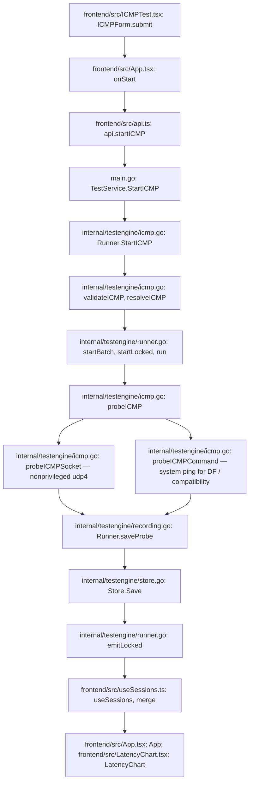

`List(current-icmp)` scopes current rows to ICMP. `Stop`, `Record`, `Restart`, `Dismiss`, `Get`, `Timeline`, `OpenChart`, and `ExportChart` reuse shared lifecycle methods. Dismiss closes only a stopped row and its chart, preserving recorded history; `Remove` deletes history separately. Recording begins with future probes only.

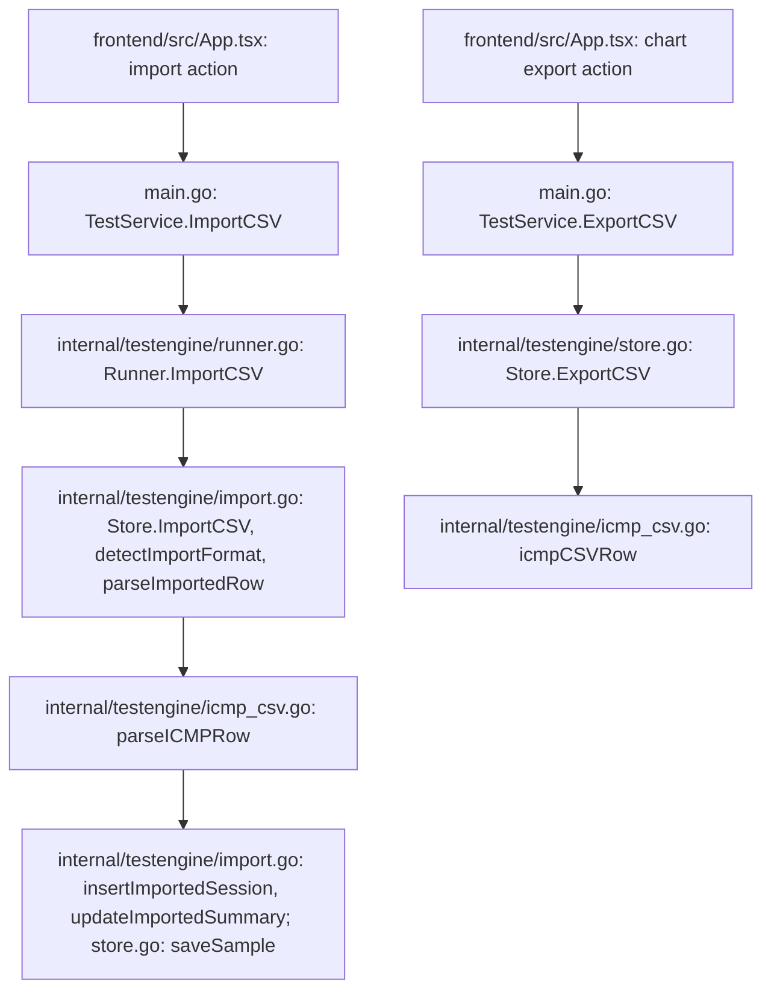

CSV accepts the exact 16-column legacy ICMP format and the desktop format with appended Test ID, Interval (ms), Timeout (ms), Time (UTC), and DF. Legacy replay defaults to 1s/4s and DF OFF because the legacy CSV omits those settings; an import note discloses this. Hostnames in both legacy destination columns are accepted and resolved on replay, not during import. Statistics cover recorded rows only. The existing bounded transactional streaming import, paginated export, and chart queries apply without schema changes.

## Version 2.0.0 transport metadata

HTTP probes in `internal/testengine/runner.go: probe` send `User-Agent: net-test/2.0.0`. This identifies the renamed application; local bridge method signatures and stored formats are unchanged. The start/save flow above includes the HTTP probe step.

## History test-type filter

`main.TestService.List(search, filter, before)` additionally accepts `stopped-http`, `stopped-dns`, `stopped-tcp`, and `stopped-icmp`. `stopped` still means all saved test types. Request/response shapes are unchanged. HTTP includes legacy configurations with missing or empty type. Protocol, saved-only, stopped-state, and endpoint predicates apply before the 50-row cursor page; no frontend full-history fetch occurs.

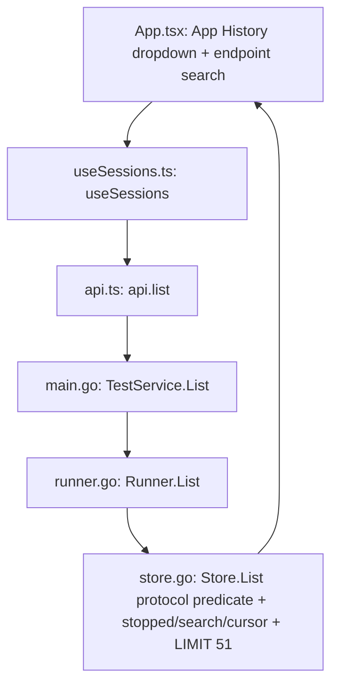

Changing test type resets the page, selection, and bulk-delete checkboxes. The dropdown is History-only and defaults to All types. The query retains the existing running-state index; protocol is a JSON predicate over matching test metadata, not raw samples. No schema change.
