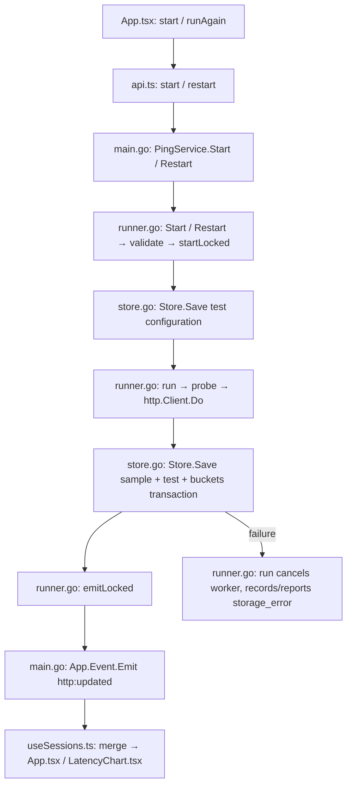
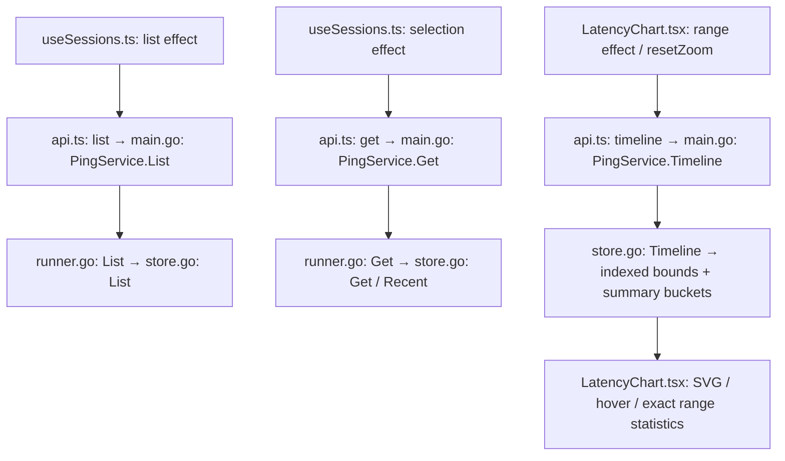
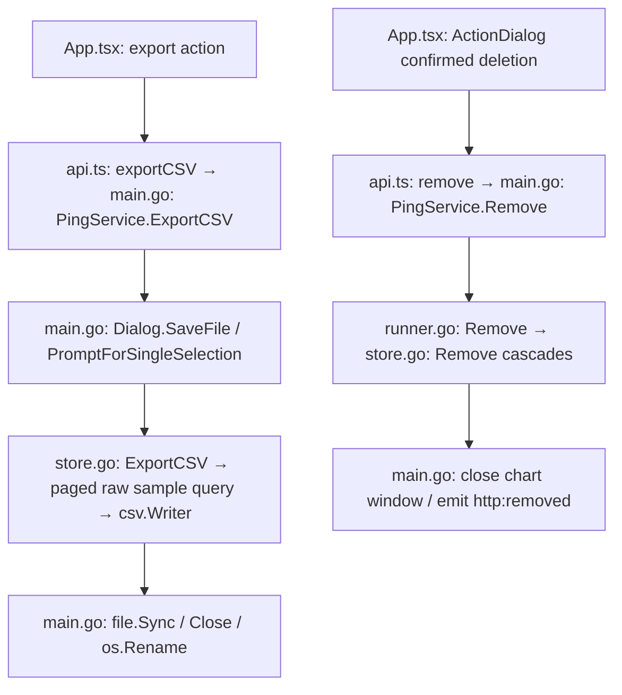
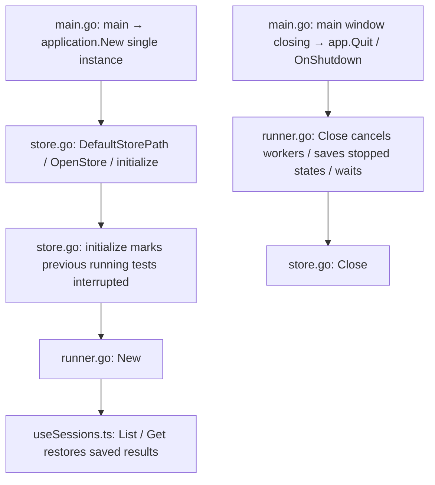

# HTTP desktop API

These are Wails-bound local Go methods, not HTTP endpoints. `frontend/src/api.ts` calls `main.PingService.<Method>` through `Call.ByName`; `main.go` registers the service. All paths below are within `wails-http/`.

## Methods

| Method | Request | Response | Frontend consumer |
| --- | --- | --- | --- |
| `Start` | `Config` | Saved running `Session`; validation/storage/capacity error | `App.tsx: start` |
| `Restart` | ID, proxy password string (empty if unused) | New saved running `Session`; original run is preserved | `App.tsx: restart / runAgain` |
| `List` | URL search, filter (`all`, `running`, `stopped`), before cursor (0 initially) | `Page`: up to 50 sessions newest first, next cursor (0 at end), active count | `useSessions.ts: useSessions` |
| `Get` | ID | `Detail`: current `Session` and up to six recent raw samples, oldest first | `useSessions.ts: selection effect` |
| `Timeline` | ID, inclusive from/to Unix milliseconds (0 means default bound) | `Timeline`: ordered representative samples, exact count/succeeded/average/maximum, range, revision, aggregated flag | `LatencyChart.tsx: range effect` |
| `Stop` | ID | Saved stopped `Session`, or storage/not-found error | `App.tsx: stop` |
| `Remove` | Stopped ID | Void; permanently deletes the test, samples, and summaries | `App.tsx: deletion dialog` |
| `ExportCSV` | ID | Saved file path, empty string on dialog cancellation, or error | `App.tsx: chart export action` |
| `OpenChart` | ID | Void; opens/focuses a native chart window | `App.tsx: chart actions` |

The previous `Get` complete-history transfer has been replaced by `Timeline` range queries. `List` is now paginated. `Restart` requires re-entry of a previously used proxy password. These contracts change together with the only bundled frontend consumer.

## Models

`Config`: complete HTTP/HTTPS `url`, `method` (GET/PUT/PATCH), `intervalMs` (1000–60000), `timeoutMs` (1000–30000), `acceptedStatuses` (one to twenty status groups 2xx–5xx or codes 200–599), and `proxy` (enabled, HTTP/HTTPS URL, username, password). Returned/saved configurations always redact the proxy password. TLS verification is mandatory; no user headers or request bodies are supplied.

`Session`: ID, sanitized config, running, startedAt, nullable endedAt, monotonic revision, sent/succeeded counts, successful-response minRtt/maxRtt/avgRtt, nullable last sample, endReason (empty while running; stopped/interrupted/storage_error), saveError, passwordRequired. All RTT values are milliseconds. Dates in models are RFC3339; timeline bounds use Unix milliseconds. Eight active tests maximum; no historical session/probe retention cutoff.

`Sample`: one-based sequence, time, RTT, statusCode (0 for no HTTP response), success, error. Sequence counts completed, saved probes. A storage-failed or explicitly cancelled probe is not counted as saved.

`Timeline` statistics refer to the entire selected raw range, not just representative points. Overview samples retain actual first/last/min/max/failure representatives. Requests are read within one database transaction; revisions identify their saved snapshot. Dense representative output is bounded by the bucket decomposition; raw samples remain on disk. Zoom far enough to receive individual samples.

## Events

| Event | Payload | Producer | Consumers |
| --- | --- | --- | --- |
| `http:updated` | Session with latest sample and revision | `runner.go: emitLocked` → `main.go: App.Event.Emit` | `useSessions.ts: merge`, `App.tsx`, `LatencyChart.tsx` |
| `http:removed` | ID | `main.go: PingService.Remove` after successful deletion | `useSessions.ts: removal listener` |

The runner emits updates on start, committed samples, stop, and saving failure. Consumers reject stale revisions. List/detail subscriptions reconcile events that arrive while the initial query is in flight. Timeline requests discard responses belonging to obsolete ranges. Recent probe buffers contain at most six samples; no raw full-history polling occurs.

## Start and save flow

## History and timeline flow

## Export and deletion flow

## Startup and shutdown flow

No network tests automatically resume on startup. No Fyne database is opened, imported, or upgraded.
