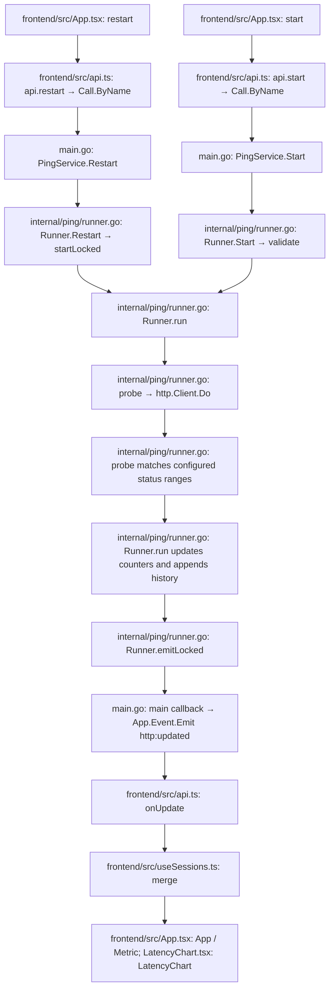
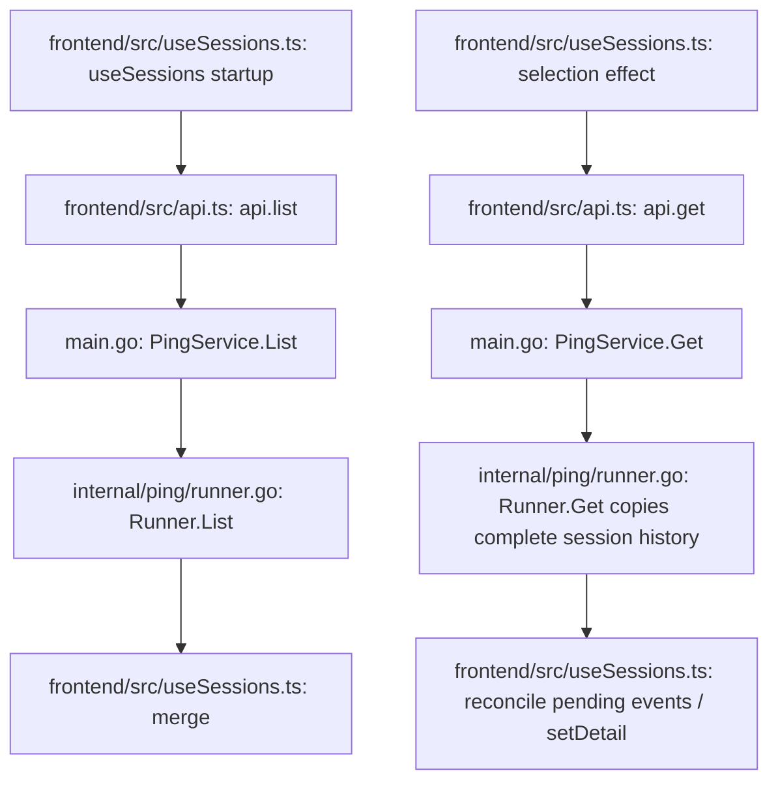
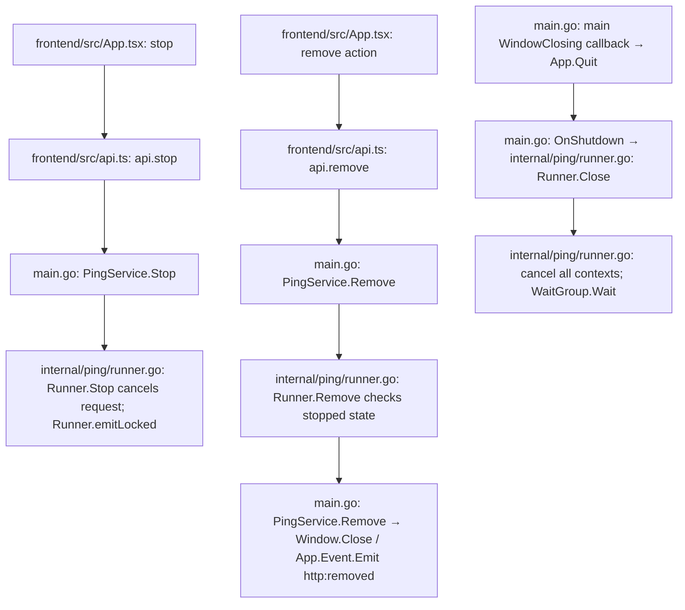
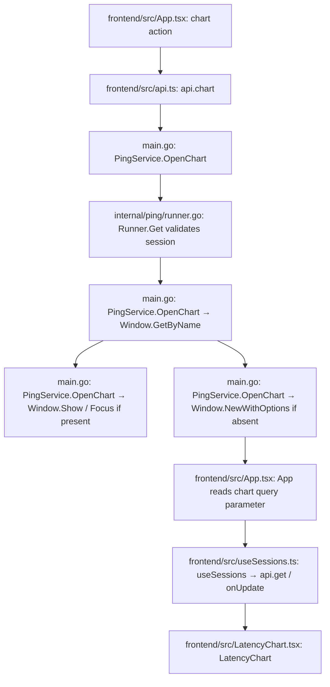

# HTTP prototype desktop API

These APIs are Wails bound Go methods, **not HTTP endpoints**. Calls are local to the desktop runtime. `wails-http/frontend/src/api.ts` invokes `main.PingService.<Method>` using `Call.ByName`; `wails-http/main.go` registers `PingService` with `application.NewService`.

## Method contract

| Bound method | Request | Response | Consumer |
| --- | --- | --- | --- |
| `main.PingService.Start` | `Config` | `Session`, or validation/capacity error | `App.tsx: start` |
| `main.PingService.List` | None | `Session[]`, oldest first; empty array when none | `useSessions.ts: useSessions` startup |
| `main.PingService.Get` | Session ID string | `Detail`, or not-found error | `useSessions.ts: useSessions` selection effect |
| `main.PingService.Stop` | Session ID string | Stopped `Session`, or not-found error | `App.tsx: stop`, main and chart windows |
| `main.PingService.Restart` | Stopped session ID string | New running `Session`, or active/not-found/capacity error | `App.tsx: restart`, main and chart windows |
| `main.PingService.Remove` | Stopped session ID string | Void, or active/not-found error | `App.tsx: App` row remove action |
| `main.PingService.OpenChart` | Session ID string | Void, or not-found error | `App.tsx: App` chart actions |

`Config` has `url` (complete HTTP/HTTPS URL), `method` (`GET`/`PUT`/`PATCH`), `intervalMs` (1000–60000), `timeoutMs` (1000–30000), `acceptedStatuses`, and `proxy`. The form stores the address without a scheme and combines it with the selected HTTP/HTTPS value before `api.start`; HTTPS is the interface default. `acceptedStatuses` contains one to 20 unique values: status groups `2xx` through `5xx`, exact codes from 200 through 599, or a combination. `proxy` contains `enabled`, an HTTP/HTTPS proxy `url`, and optional `username`/`password`. Proxy URLs cannot contain credentials, a path, query, or fragment; credentials are supplied through their separate fields. URLs are limited to 4096 characters and cannot contain credentials or fragments. Limits are 8 active and 24 retained sessions.

`Session` contains `id`, `config`, `running`, `startedAt`, nullable `endedAt`, monotonic `revision`, `sent`, `succeeded`, `minRtt`, `maxRtt`, `avgRtt`, and nullable `last`. Timestamps are RFC3339 strings; RTT fields are milliseconds. RTT aggregates include successful probes only. Empty aggregates are zero, rendered as a dash until there is a successful response. `sent` counts completed probes; explicit cancellation is excluded.

`Sample` contains `sequence` (one-based), `time`, `rtt`, `statusCode` (zero if no HTTP response), `success`, and `error` (empty on success). A received response is successful when it matches any configured status group or exact code; redirects are not followed. `Detail` contains `session` and every sample collected by that session in chronological order. History is held in memory until the session is removed or the app quits.

Returned session configuration never contains a proxy password. The runner retains the credential privately for the session lifetime so `Restart` can create a new session with the same configuration. Restarting does not mutate or remove the stopped source session.

## Events

| Event | Payload | Producer | Consumer |
| --- | --- | --- | --- |
| `http:updated` | `Session`, including latest sample | `runner.go: Runner.emitLocked` → `main.go: main` callback → `App.Event.Emit` | `api.ts: onUpdate` → `useSessions.ts: merge` → `App.tsx`, `LatencyChart.tsx` |
| `http:removed` | Session ID string | `main.go: PingService.Remove` → `App.Event.Emit` | `api.ts: onRemove` → `useSessions.ts: useSessions` |

Updates occur on start, completed probe, and stop. Each carries a summary and at most one sample, not the whole history. Consumers ignore stale revisions. Selection subscribes before fetching detail and reconciles updates received during the snapshot. Removed IDs are ignored if older queued updates arrive.

## Start and results flow

## Snapshot flow

## Stop, remove, and shutdown flow

## Chart window flow

The original Fyne application has no API changes. This prototype has no persistence or external control endpoint. Request errors omit the URL wrapper so query tokens are not duplicated into error messages; the user-entered URL itself remains part of session configuration and is displayed in the UI.
