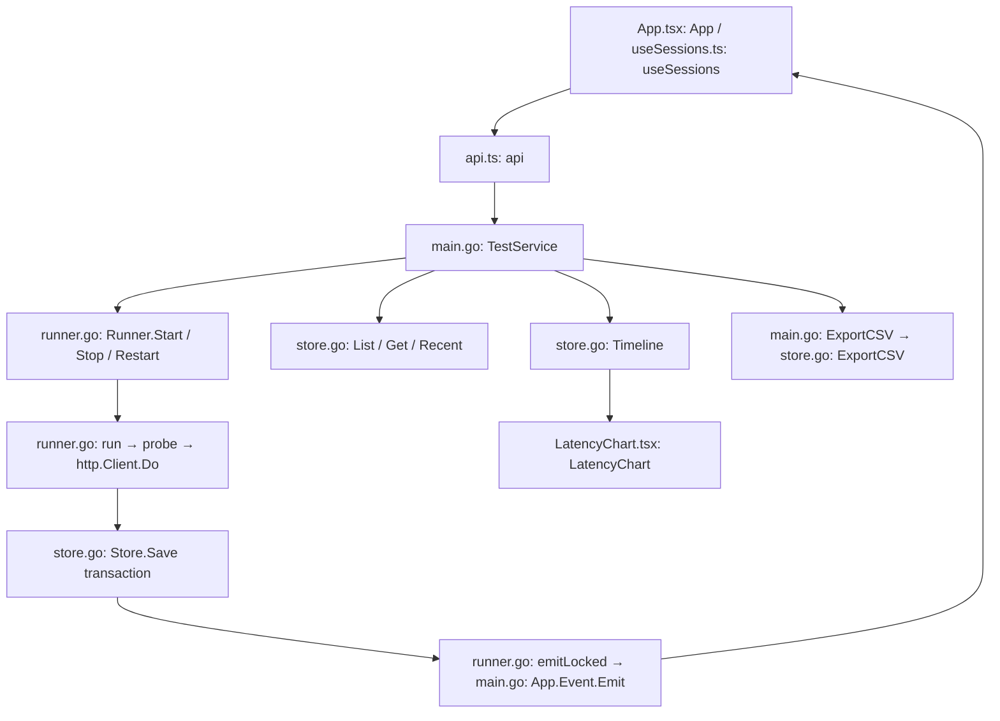

# Net Test desktop architecture

The `desktop/` module is the Net Test desktop application. It provides a shared test lifecycle, optional per-test recording, saved History, full-timeline graphs, HTTP/DNS/TCP/ICMP CSV import/analysis, and CSV/PNG export. HTTP/HTTPS, DNS, TCP, and ICMP tests share the application services. The root Fyne application's behavior and database are unchanged; both applications share the refreshed Net Test branding. Wails starts with a fresh database; there is no legacy database migration. Explicit legacy HTTP/DNS/TCP/ICMP CSV import creates independent stopped analysis sessions.

## Run and build

Requirements: Go 1.25+, Node 24 LTS (or another version supported by the locked Vite release), npm, and the native dependencies for Wails v3.0.0-beta.17. The Go and JavaScript Wails versions are pinned together. Wails v3 remains a beta framework, so native release builds require platform testing.

From `desktop/`:

```sh
make setup
make run
# macOS application bundle:
make mac-app
```

The frontend must be built before Go because `main.go` embeds `frontend/dist`. The source `frontend/index.html` cannot run the desktop backend when opened as a file. `npm --prefix frontend run dev` starts only the frontend.

`Makefile` matches macOS C compiler and linker deployment targets at 11.0. This is a build setting, not a claim that older macOS versions have been runtime tested. The unsigned bundle has its own identifier, `net.packetstreams.ntgui.wails`.

`.github/workflows/desktop.yml` defines native builds and race tests on macOS, Windows, and Ubuntu 24.04. Linux uses GTK4/WebKitGTK 6.0. Windows needs WebView2 at runtime. CI execution and interactive Windows/Linux tests require those environments; adding the workflow does not establish that they have passed. Signing and installers are a later milestone.

## Storage and lifecycle

`internal/testengine/store.go: DefaultStorePath` resolves `os.UserConfigDir()/nt-wails/results.db` on each OS. A development-only `NET_TEST_DATA_DIR` environment override can isolate smoke tests; the former `NT_WAILS_DATA_DIR` name remains accepted for compatibility. The existing storage path is retained so saved results remain available. This never discovers or opens Fyne's `ntdata.db`.

`application.New` acquires the Wails single-instance identity before opening storage. A second launch focuses the main window. `OpenStore` creates schema version 1 and rejects newer versions. SQLite uses WAL, foreign keys, a one-second busy timeout, FULL synchronous commits, and one connection. Newly created database files have mode 0600 and new directories mode 0700 where supported by the OS.

- `tests`: configuration, lifecycle, and statistics in sanitized JSON, with indexed running state.
- `samples`: original sample JSON, sequence primary key `(test_id, seq)`, and indexed `(test_id, time, seq)` access.
- `buckets`: incrementally maintained radix-4 summaries, indexed by test, level, and bucket. These retain first/last, successful min/max, a failure representative, and exact counts/sums. Twenty levels cover practical long-duration runs; the raw sample table has no retention cutoff.

Every initially recorded HTTP, DNS, TCP, or ICMP probe commits its sample, statistics, and summaries in one transaction before emitting a UI event. Tests started with recording off retain raw samples and chart buckets in an in-memory SQLite store; no session metadata or probe data is written to durable storage. Enabling recording saves the session and subsequent probes, keeping the earlier live chart until row close or app exit. There is no asynchronous unsaved queue. The worker stops and reports an explicit saving error if a transaction fails; it does not report that sample as saved. The current save error also stays in runtime state if the database cannot record it. Persisted results remain until explicit deletion.

Normal shutdown cancels all workers, records stopped states, waits for workers, and closes storage. Reopening restores history without sending requests. Any previously running records are marked interrupted with their last saved probe as the interruption boundary. No claim is made about an uncommitted, in-flight request surviving a crash.

Active tests are capped at 8. Historical tests are not capped at 24: history uses pages of 50 and a row-ID cursor. Go retains active/current session metadata. Sessions started without recording additionally retain their live raw samples and chart buckets in memory until closed/deleted or app exit, matching Fyne live chart availability. React holds one page, selected metadata, six recent probes, and the displayed timeline summary.

## HTTP semantics

- HTTPS is the default scheme. The form accepts a host/path without a scheme and also handles pasted complete URLs.
- GET, POST, PUT, PATCH; requests send no body. Requests use fresh connections and measure time to response headers. Redirects are not followed by default; an explicit option follows redirects to the final response, matching the legacy capability.
- Configurable interval and timeout (at least one second, bounded only by the supported duration), expected status groups/exact codes, and optional authenticated HTTP/HTTPS proxy.
- Default accepted statuses are 2xx and 3xx. Latency min/max/average include successful probes only. Explicit stop cancellation is not a failed probe.
- Normal system certificate verification remains enabled for targets and proxies. The independent adapter remains necessary because the existing nt dependency's HTTP implementation lacks caller context cancellation and disables TLS verification.
- Proxy passwords are never returned in session snapshots or saved in SQLite. A saved password-required flag makes Run again request the credential. No OS credential store is introduced.

## Interface, themes, and timeline

The sidebar uses the shared vector Net Test logo. The top-left brand is the
single About entry point: `App.tsx: App` opens an `ActionDialog` containing a
short product description, version 1.1.0, developer attribution, and the
project-home link. `Browser.OpenURL` sends that link to the operating system's
browser. The former inline About panel, bottom About button, and implementation
label are absent. Runtime icons and native macOS, Windows, and Linux packaging
follow the [branding architecture](branding.md).

`style.css` defines dark and light palettes as shared semantic tokens for canvas, surfaces, text, borders, controls, status feedback, charts, overlays, and shadows. Components consume those tokens so new interface elements can support both appearances without component-specific theme overrides. `App.tsx: initialTheme` restores the saved preference or uses the operating-system preference on first launch. `App.tsx: App` applies changes to the document, persists them in local storage, and synchronizes detached chart windows through storage events. The top-right theme button is available in both the main and detached windows.

The HTTP Tests section shows tests started during the current app session, both running and stopped; History shows only stopped, interrupted, failed-saving, and imported sessions. Both tabs place the test list above the statistics cards. `App.tsx: App` derives the existing server-side list filter from the tab, and also filters the bounded current page during navigation and live updates. HTTP Tests automatically selects a session test and shows its metrics, timeline, recent probes, and detached-chart actions. History initially shows only its saved-test list, including after CSV import; selecting a row reveals its metrics and full-width timeline. History omits recent probes and detached-chart actions. Stopping the selected test preserves its details. `Store.Save` records new running IDs in a connection-local SQLite temporary `current_tests` table in the save transaction; `Store.List` uses its indexed IDs for the `current` filter. This avoids retaining stopped worker state or loading full History into frontend memory. The temporary membership disappears on store close; persisted test and probe data remain available in History. `useSessions` hides a previous query page while switching filters to avoid selecting an unrelated History record. `App.tsx: runAgain` returns to HTTP Tests and selects the new run. Detached chart windows retain their original session identity. History offers URL search, page navigation, replay, and confirmed permanent deletion. Deletion cascades to raw samples and summaries and closes a matching chart window.

`LatencyChart` requests a timestamp range from `TestService.Timeline`. Full mode follows the test start through now (or its stopped boundary). Moving a handle fixes a historical range; Reset restores the full range and resumes live following. Pause freezes the chart's time boundary while probes and saving continue. The zoom controls remain available for empty periods. Obsolete asynchronous responses are ignored when ranges change.

`Store.Timeline` finds range bounds through the time index, decomposes the corresponding sequence interval into aligned summary buckets and exact edge samples, and returns exact visible counts/average/max with representative points. It does not transfer or scan the entire history for every update. Dense views are labelled as overviews; zoom reveals individual probes. Hover describes an actual displayed raw representative, not a synthetic averaged probe. Timestamps are expected to follow collection order; abrupt backward system-clock changes need additional handling before a general production release.

`Store.ExportCSV` reads original samples in pages of 256 to a fixed sequence watermark. Exports include all saved probes through that watermark, regardless of chart zoom or pause. `TestService.ExportCSV` uses a native save dialog, writes/syncs a temporary file in the destination directory, and renames it only after success. Failed exports clean up their temporary file. Export of a running test is a snapshot and does not include later probes.

## Architecture



The desktop bridge uses typed local `Call.ByName` wrappers. `TestService` and the `test:*` events use protocol-neutral names so additional protocol adapters can join the same lifecycle without renaming the application API. Generated bindings and a shared multi-protocol session model can follow when the next protocol is implemented. No REST control server or new frontend framework is introduced.

## Validation and remaining work

```sh
go test -race ./internal/testengine
npm --prefix frontend run build
make mac-app
```

Tests cover HTTP methods/statuses/proxy redaction, cancellation, TLS rejection, saving failure and atomic rollback, recovery of 4,200 probes, exact range statistics and preserved latency peaks, uncapped historical sessions/pagination, complete CSV ordering, export errors, cascade deletion, normal shutdown, and unsupported schema versions.

Verified locally: frontend build, race tests (4,200 saved probes and 125 historical sessions), macOS build without deployment-target warnings, and Windows amd64 cross-compilation. The native macOS smoke test confirmed pause with continued saving, CSV export, both zoom handles/reset, separate replay, quit/reopen with two restored stopped sessions, selection from a non-URL cell, visible metric cards, and deletion confirmation/cancellation. The workflow has not been run remotely.

Remaining phases: native Windows/Linux interactive verification; long soak and million-sample performance testing; TCP/DNS/ICMP adapters and their CSV formats; settings; signing/installers and release QA. HTTP CSV analysis is now integrated with saved history; no Fyne database migration is planned. There is no automatic disk cleanup: storage errors stop the affected test visibly. Large exports and imports stream but do not yet have an application-level progress/cancel control. Import requires no active tests and is limited to 256 MiB / one million rows.


## DNS parity with Fyne

Reference: root `Function_NewTest.go: NewTest`, `DNS_Ping_UI.go: DNSPingContainer`, `DNS_Ping_Func_Struct.go: dnsGUIRow / DnsAddPingRow`, `Function_NewChartWindow.go: NewChartWindow`, `Function_CSVExport.go`, and the pinned `nt v1.4.0` `ntPinger.DnsProbing` implementation.

- `frontend/src/DNSTest.tsx: DNSForm` accepts multiple resolver IPs (one per line), query domain, UDP/TCP, interval, timeout, and recording. Defaults are UDP / 1 second / 4 seconds / recording off. Positive whole-second validation and IP-only resolvers match Fyne.
- `dns.go: probeDNSWithResolver` retains Fyne LookupHost semantics, IPv4-only comma-separated response text, RTT measured before LookupCNAME, A/CNAME classification, and recognizable DNS error labels. Standard-library contexts additionally provide prompt Stop/shutdown cancellation. No new dependency is needed.
- Per the user's follow-up, `App.tsx` renders one shared HTTP/DNS/TCP/History table: Endpoint, Status, Latest, Average, Failure, Probes, Actions. DNS resolver/query are the endpoint; transport/start time and recording appear as compact secondary text. Full response values remain available in tooltips. Actions are at the right, with one state-dependent Stop/Run again button. Test index and zero-based DNS sequence remain in chart metadata. This supersedes copying Fyne's separate wide table layout; DNS probing and recording semantics are preserved.
- Chart is enabled after three probes; Stop, replay, and Close follow Fyne availability. Close removes only the workspace row and releases volatile chart data; history is retained. History deletion remains the existing confirmed permanent action.
- The shared chart provides pause, range selection/reset, detached windows, PNG and recorded CSV export. Record can be enabled while a DNS test is running and saves future probes only. Recorded data survives restart; unrecorded raw data does not.
- `runner.go` adds a DNS branch without changing HTTP validation or transport security. `store.go` keeps schema version 1: optional JSON model fields avoid a database migration. Current protocol filters operate on current-session IDs before returning keyset pages.
- `dns_csv.go` supports native DNS exports with Fyne columns plus replay metadata, and imports the original 18-column Fyne format. Import remains streamed and transactional with existing byte/row bounds. No Fyne database is opened.

Desktop conventions retained: eight active tests across protocols, bounded/paginated UI queries, current dark/light styling, and indexed chart summaries. Long-running Tests started with recording off consume growing RAM for the complete live chart, as Fyne does; use recording from the start for disk-backed long runs. Initial recording-on runs do not allocate a duplicate in-memory sample store. History summaries may cover the full run while recorded raw charts cover only the interval after recording was enabled.

Validation lives in `internal/testengine/dns_test.go`: UDP/TCP local wire fixtures (A, CNAME, IPv6-only display behavior, NXDOMAIN, timeout/cancellation), batch validation/capacity, recording boundaries, close/history/replay, failed-save rollback, reopen behavior, native and legacy CSV roundtrips and malformed-import rollback. Native visual QA and Windows/Linux interactive verification require their respective unlocked environments.


## Shared recording option

HTTP and DNS new-test forms now expose the same Recording checkbox, off by default. `recording.go` owns `recordingEnabled`, `prepareLiveResults`, `removeLiveResults`, `resultsStore`, `saveProbe`, `Runner.Timeline`, and `Runner.Record` for both protocols. A test started with recording on uses only the durable store; a test started off uses the in-memory chart store and no durable metadata. Record saves future probes only. HTTP transport/proxy/TLS behavior is unchanged.

Compatibility uses the existing `Config.type` discriminator: old HTTP snapshots omit type and retain always-record semantics. New HTTP forms explicitly send type=http and recording=true/false. This also handles early desktop snapshots that contained recording=false before HTTP supported the option. No schema migration or rewrite is needed. Native HTTP CSV imports accept partial recordings and preserve the existing columns.

The shared table displays recording state for HTTP and DNS, with all actions at the right. DNS resolver/query details stay within the endpoint cell; response text appears beneath its status badge, capped at 40 characters with an ellipsis and the full response in a hover tooltip. Both form headings are New test. `recording_test.go` covers HTTP recording boundaries, live charts, partial export/import, replay, and legacy compatibility; DNS tests also exercise the shared recording implementation.


## Temporary tests when recording is off (2026-09-10)

Recording OFF now keeps the entire test in memory, with no History entry and no metadata/sample/bucket writes to the persistent SQLite file. The shared `recording.go: saveProbe` gate applies to every lifecycle path. `prepareLiveResults` also holds lightweight metadata for recorded current tests so a single memory store can paginate both kinds of current rows; recorded-on tests still avoid duplicate raw sample storage. The existing in-memory indexed SQLite implementation is not a disk database.

`runner.go: List` routes current/running filters to memory and History filters to the durable store. `Get/Restart/Stop/Remove` route through `resultsStore`. `dns.go: Dismiss` releases temporary data and removes the stopped worker so shutdown cannot recreate a closed row. `main.go: ExportChart` validates via Runner.Get, allowing PNG export of unrecorded live data. Turning recording on writes the first durable session entry and saves subsequent probes only.

Prior builds' explicitly unrecorded stored summaries are hidden from History but are not deleted. Legacy missing-type HTTP recordings remain visible. No schema migration. `recording_test.go: TestUnrecordedLifecycleNeverWritesDisk` runs both HTTP and DNS with the persistent connection forced read-only, verifies live/current results and replay/close/shutdown, then reopens the file and asserts zero tests, samples, and buckets.


## TCP migration from Fyne

`TCPTest.tsx: TCPForm` follows the DNS form with one server IP/hostname per line,
a shared port (1–65535), whole-second interval and timeout (defaults 1s/4s),
and recording off by default. IPv4 and IPv6 are supported. `tcp.go: StartTCP`
validates every target before resolution, caps batches at eight, resolves hostnames
with bounded lookups, and passes the complete batch to `runner.go: startBatch`.
No probe starts if validation, resolution, capacity, or persistence fails.
Duplicate input lines create separate tests, matching Fyne.

`tcp.go: resolveTCP` stores the first resolved IP in `Config.ResolvedIP` while
retaining the original hostname for display/search. Each run and its replay use
that pinned IP, matching Fyne's target selection. Legacy CSV without a resolved
IP is resolved at replay start. `probeTCP` uses context-aware `net.Dialer` and
`net.JoinHostPort`; RTT covers the TCP handshake with no application payload.
Connections close immediately. Failure labels preserve `Conn_Refused`,
`Conn_Timeout`, `No_Route`, and `Network_Unreachable`; other errors are reported
as failed probes. Stop and shutdown cancel pending probes without adding a failure.
TCP/DNS workers do not allocate an HTTP transport.

The shared lifecycle supplies the eight-active-test limit, successful-only RTT
statistics, temporary results, future-only recording, indexed timeline buckets,
chart windows, PNG export, saved History, replay, and deletion. `current-tcp`
filters the shared current-session store, with independent TCP row indices.
TCP Close uses `runner.go: Dismiss` to retain recorded History. Like DNS, the
row chart button requires three probes and CSV export is offered after stopping.
Hover and selected row colors use the existing shared table styles.

`tcp_csv.go` supports the 17-column Fyne TCP format and appends test ID,
interval, timeout, and nanosecond UTC time for desktop exports. Legacy replay
defaults to 1s/4s and recording on. Imports stream through the existing bounded,
transactional parser, reject changing test metadata, and recalculate statistics
from recorded rows. Legacy hostname-in-both-address-columns is accepted without
performing network operations during import. Nonzero payload CSVs are rejected
because the Fyne GUI TCP form always uses zero payload.

Files/functions: `tcp.go` (`validateTCP`, `resolveTCP`, `StartTCP`, `probeTCP`,
`tcpError`), `tcp_csv.go` (`tcpCSVRow`, `parseTCPRow`), `runner.go` (`validate`,
`Start`, `startBatch`, `startLocked`, `run`, `Restart`, `Dismiss`), `store.go`
(`List`, `ExportCSV`, `discardUnstarted`), `import.go` (`detectImportFormat`, `parseImportedRow`,
`ImportCSV`, `consistentImport`), `main.go` (`TestService.StartTCP`, `ImportCSV`),
`api.ts`, `TCPTest.tsx`, `App.tsx`, `LatencyChart.tsx` (TCP PNG labels and hover details), and `style.css`. DNS batch start and row close
now use shared runner helpers. No schema migration or Fyne code change is needed.

Validation lives in `tcp_test.go`: local connection success/refusal/cancellation,
timeout, validation, batch capacity, protocol filtering, recording, replay,
dismissal, CSV round trip, database reopen, and transactional import rollback.
Native Windows/Linux runtime verification remains platform-specific work.

Aborted DNS/TCP batch cleanup uses `store.go: discardUnstarted` to transactionally delete only the newly created session and current membership while the runner lock prevents any probe delivery. It does not attempt another upsert after a persistence failure. A storage-trigger regression test covers this path.


## ICMP adapter

`internal/testengine/icmp.go` adds IPv4 echo probing to the shared runner. macOS/Linux ordinary probes open an unprivileged ICMP datagram socket (`udp4`), never a raw socket. Each request uses a dedicated socket and random payload to reject unrelated replies; context cancellation closes the socket. DF probes and systems without datagram support use the installed `ping` executable through argument arrays with a context deadline, bounded output, and hidden Windows console. The application does not request root/admin privileges or change system permissions. Linux host policy can disable unprivileged ICMP; the compatibility command must be available and usable under the current account.

Timers, statistics, live in-memory recording, durable history, chart buckets, and batch limits reuse existing infrastructure. `Config` JSON adds `payloadSize` and `df`; database schema is unchanged. The adapter limits payload to IPv4's actual 65507-byte maximum, although the old Fyne form accepted values above its backend limit. IPv6 remains unsupported, consistent with Fyne's native ICMP implementation. Legacy CSV does not preserve DF/timers; the imported session explains its replay defaults. Windows command parsing currently expects English ping output; Unix commands request the C locale.
