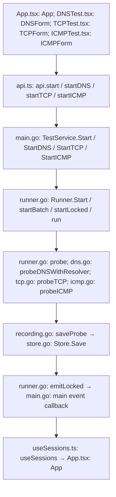

# NET-Test v2.0.0 architecture

`desktop/` is the only Go module and desktop application. Wails owns native windows and dialogs; React renders the interface. The independent `internal/testengine` package owns network probes, lifecycle, storage, and CSV handling. Root build targets delegate to `desktop/Makefile`.

## Lifecycle and storage

`main.go: main` registers `TestService`, obtains the single-instance identity, opens storage, creates the runner, and opens the main window. Shutdown calls `Runner.Close` before `Store.Close`. Reopening marks previously running saved tests interrupted and never resumes probes.

`store.go: DefaultStorePath` retains `os.UserConfigDir()/nt-wails/results.db`. The single-instance/bundle ID remains `net.packetstreams.ntgui.wails` to preserve installation continuity. `NET_TEST_DATA_DIR` and the compatibility alias `NT_WAILS_DATA_DIR` can isolate development data. Legacy `ntdata.db` is not discovered, modified, or migrated.

SQLite schema version 1 stores tests, samples, and radix-4 timeline buckets. WAL, foreign keys, FULL synchronous commits, a one-second busy timeout, and one connection protect persistence. Samples, statistics, and buckets commit together. Saving failure stops the affected worker visibly. New database files/directories use restrictive permissions where supported.

`recording.go: prepareLiveResults / saveProbe / resultsStore / Runner.Record` route temporary tests to memory and recorded probes to durable storage. Recording defaults off; enabling it saves future probes only. Recorded runs avoid duplicating raw samples in memory. Temporary results disappear on close or exit. Old HTTP configurations without a type retain their existing recording semantics.

Eight active tests share one runner. History uses 50-row keyset pages. Timeline queries use indexed bounds and summary buckets with exact range counts and successful latency statistics. Representative points retain actual samples. CSV exports stream pages of 256 to a fixed sequence watermark. No raw-history polling or automatic retention cutoff is introduced.

## Protocols

- HTTP: `runner.go: validate / probe` uses context-aware HTTP requests, fresh connections, system TLS verification, optional redirects, expected statuses, and proxy authentication. RTT ends at response headers. No request bodies or custom headers are supplied. Passwords are redacted from saved and returned configurations.
- DNS: `dns.go: StartDNS / probeDNSWithResolver` handles UDP/TCP resolver batches, IPv4 response display and A/CNAME classification with cancellation.
- TCP: `tcp.go: StartTCP / resolveTCP / probeTCP` resolves a target once per run, pins its IP, measures connection time, and closes the connection without application payload.
- ICMP: `icmp.go: StartICMP / probeICMP / probeICMPCommand` supports IPv4 echo, payload size, and DF. Datagram sockets are preferred where available; the system ping command provides compatibility. No privilege elevation occurs.

Batch validation and capacity checks precede probes. Stop cancellation does not count as a failed probe. CSV adapters preserve legacy formats and replay defaults without importing any legacy UI dependency.

## Interface

`App.tsx: App` renders protocol forms, the shared table, History, selection, actions, and About version 2.0.0. `useSessions.ts` reconciles local bridge queries and events. `LatencyChart.tsx` provides indexed timeline views, pause, range selection/reset, hover, and PNG generation. `main.go: TestService.OpenChart` opens a separate native chart window.

`style.css` supplies shared dark/light tokens and separate hover/selected states. The existing `net-test-theme` local-storage key is retained. Unrecorded sessions can display charts; CSV export requires recorded samples. History deletion and closing a current test are distinct operations.

## Call flow

## Validation and limitations

Run `make test` and the native package target. Tests cover protocol fixtures, cancellation, batch failures, temporary/durable recording, recovery, pagination, timeline statistics, import rollback, and exports. Native packaging configuration exists for macOS, Windows, and Linux; configuration alone does not establish runtime verification.

Wails Go/runtime versions are pinned together at 3.0.0-beta.17. Windows requires WebView2; Linux builds use GTK4/WebKitGTK 6.0. ICMP command parsing on Windows expects English output; IPv6 ICMP is unsupported. Unrecorded long runs grow memory. Imports require idle tests and are bounded to 256 MiB/one million rows. Import/export progress cancellation, million-sample soak testing, backward-clock handling, signed installers, and platform release QA remain future work.

## History type selection

`App.tsx: App` places an All types / HTTP / DNS / TCP / ICMP dropdown beside endpoint search. `Store.List` combines the selected protocol with saved-only/stopped/search conditions before keyset pagination. Existing API signatures and schema stay unchanged. Changing type clears page/selection/bulk selection; current test tabs are unaffected.
