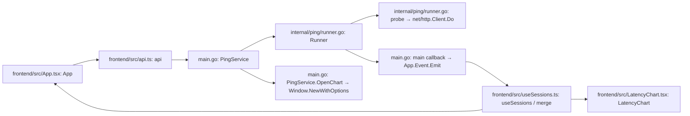

# HTTP Ping desktop prototype

The `wails-http/` directory is an independent Wails v3 desktop application with a Vite, React, TypeScript, Tailwind CSS, and Framer Motion frontend. The existing Fyne executable, Go dependencies, SQLite data, and protocol implementations are unchanged.

## Run

Prerequisites: Go 1.25 or later, Node.js 22.12+ (or a newer supported LTS), npm, and the platform dependencies for the pinned Wails **v3.0.0-beta.16** release. Go and frontend runtime versions are pinned together; this is a beta-based prototype, not a replacement production release.

From the repository root, on macOS/Linux:

```sh
cd wails-http
make setup
make run
```

Equivalent commands without Make (also usable in PowerShell):

```sh
cd wails-http
npm --prefix frontend ci
npm --prefix frontend run build
go build -tags production -o bin/nt-http .
```

Launch `./bin/nt-http` on macOS/Linux. On Windows, use:

```powershell
go build -tags production -ldflags "-H windowsgui" -o bin/nt-http.exe .
.\bin\nt-http.exe
```

For a double-clickable macOS app bundle, run `make mac-app` and open
`wails-http/bin/NT HTTP Prototype.app`. This local bundle is unsigned.

Build on each target OS with its native toolchain. macOS requires Xcode Command Line Tools. Windows requires the WebView2 runtime. Linux requires the GTK/WebKit libraries documented for this Wails release (GTK4/WebKitGTK 6.0 by default; the legacy GTK3/WebKit2GTK 4.1 path uses `-tags "production gtk3"`). No signing, installer generation, or cross-compilation setup is included yet. See the [Wails installation guide](https://v3.wails.io/quick-start/installation/).

The frontend build must run before the Go build because `main.go` embeds `frontend/dist`. Opening `frontend/index.html` as a file is not supported: it is Vite source, and the Go bridge is supplied by Wails. `npm --prefix frontend run dev` is only a frontend development server and does not supply a backend by itself.

If an existing `GOROOT` variable points at a different Go installation, correct that local environment setting. On macOS/Linux, `env -u GOROOT go build -tags production -o bin/nt-http .` uses Go's detected installation without changing shell configuration.

## Features

- Dark navy interface with blue accents, shared CSS colour tokens for controls and charts, and dark macOS/Windows window chrome.
- Multiple HTTP/HTTPS GET, PUT, or PATCH tests, with a separate scheme selector, URL validation, configurable interval/timeout, expected status groups or exact codes, and optional authenticated HTTP/HTTPS proxy routing.
- Live status, response code, time to response headers, successful-response min/max/average, and failure rate.
- Start, immediate stop/cancellation, run again, remove stopped sessions, search, and running/stopped filters. Selecting anywhere on a test row updates the metrics and live graph; rows also support Enter and Space keyboard selection while their action buttons remain independent.
- Responsive vector latency chart with a smooth blue line, gradient area, average guide, live-point pulse, hover details, and 30/120/600-probe viewing ranges.
- Separate native chart windows sharing the same Go session and events. Reopening focuses the existing window; removing its stopped session closes it. Running again from a chart creates a new session and opens its own chart, keeping the original window attached to the original test.
- Closing the main window quits the application and cancels all requests. Closing a chart does not stop its test.

## Architecture



The UI-independent runner owns lifecycle, validation, statistics, and bounded data. The desktop service only exposes methods and manages windows. The React bridge uses the pinned runtime's `Call.ByName` API; no HTTP control server or hand-maintained generated binding directory is introduced. The type names and JSON contract are documented in [the API reference](../api_reference/http-wails-prototype.md).

Each completed probe emits only the session summary and latest sample. `List()` retrieves summaries at startup; `Get()` retrieves the selected session's retained samples when selection changes. Revision checks reconcile initial snapshots with concurrent events. There is no periodic full-history polling.

## HTTP semantics and resource limits

- Probes connect directly by default or through a per-test HTTP/HTTPS proxy. Optional proxy basic credentials stay in the Go runner and proxy passwords are redacted from every returned session. TLS verification uses the system trust store for targets and HTTPS proxies.
- GET, PUT, and PATCH only. PUT and PATCH send no request body. No user headers, embedded URL credentials, or URL fragments.
- Success matches the configured status groups (`2xx`–`5xx`) and/or exact codes (200–599). The default is `2xx` and `3xx`. Redirect responses are measured as-is; redirects are not followed.
- RTT measures from request creation to response headers, including connection/TLS setup. Bodies are closed without buffering. It is not full-page download timing.
- Each probe uses a fresh connection. Each session has one worker and never overlaps requests. Interval is start-to-start, with the next probe immediate if the previous probe already exceeded the interval.
- Requests time out after 1–30 seconds; intervals are 1–60 seconds. Stop cancels the active request, and user cancellation is not counted as failure.
- At most 8 active and 24 retained sessions. Each session keeps its latest 600 samples in a ring buffer; lifetime counters and successful RTT aggregates continue beyond that bound.
- Window updates append one sample, capped at 600. Chart rendering and nearest-point inspection have bounded work.

## Implementation decisions and limitations

The existing `github.com/djian01/nt` HTTP runner was not reused in this first prototype. Its current API does not accept a request context and its transport sets `InsecureSkipVerify: true`. The independent standard-library adapter provides cancellation and normal certificate validation without modifying the existing dependency or Fyne behaviour. Consolidation into a shared, context-aware protocol service should be a deliberate follow-up.

Results are in memory only. This prototype does not implement SQLite history/recording, CSV export, arbitrary HTTP methods, custom headers, certificate overrides, ICMP/TCP/DNS pages, or a theme switcher. The dark blue theme is the default. Proxy support uses the standard HTTP proxy mechanism and optional basic credentials; SOCKS, PAC, system proxy discovery, and other authentication schemes are not included. New windows share the same data; the frontend is not a standalone network-testing website.

## Validation

```sh
cd wails-http
go test -race ./internal/ping
npm --prefix frontend run build
go build -tags production -o bin/nt-http .
```

The Go tests exercise default and custom status classification, GET/PUT/PATCH requests, redirects, authenticated proxy routing and secret redaction across restart, cancellation of in-flight requests, certificate rejection, timeout, validation, removal, and ring-buffer ordering/snapshot isolation.

Verified on the development Mac: race-enabled tests, frontend type checking/build, native app build and launch, live HTTP 200/503 results, invalid URL errors, chart hover/ranges, stopped filtering, separate chart windows, shared stop state, replay into a new chart, and main-window shutdown. A Windows amd64 executable also cross-compiled successfully. Windows and Linux runtime behaviour must be verified on those operating systems before distribution. The local macOS linker emits SDK deployment-target warnings (objects built for macOS 26 against a macOS 11 link target); the local working build does not establish compatibility with older macOS releases.

## Follow-up

1. Validate appearance, keyboard behaviour, scaling, and WebView packaging on Windows and Linux.
2. Agree on HTTP semantics and consolidate the runner behind a shared Go service.
3. Add recording/export if this design is selected.
4. Reassess the Wails release before migrating additional protocols.
