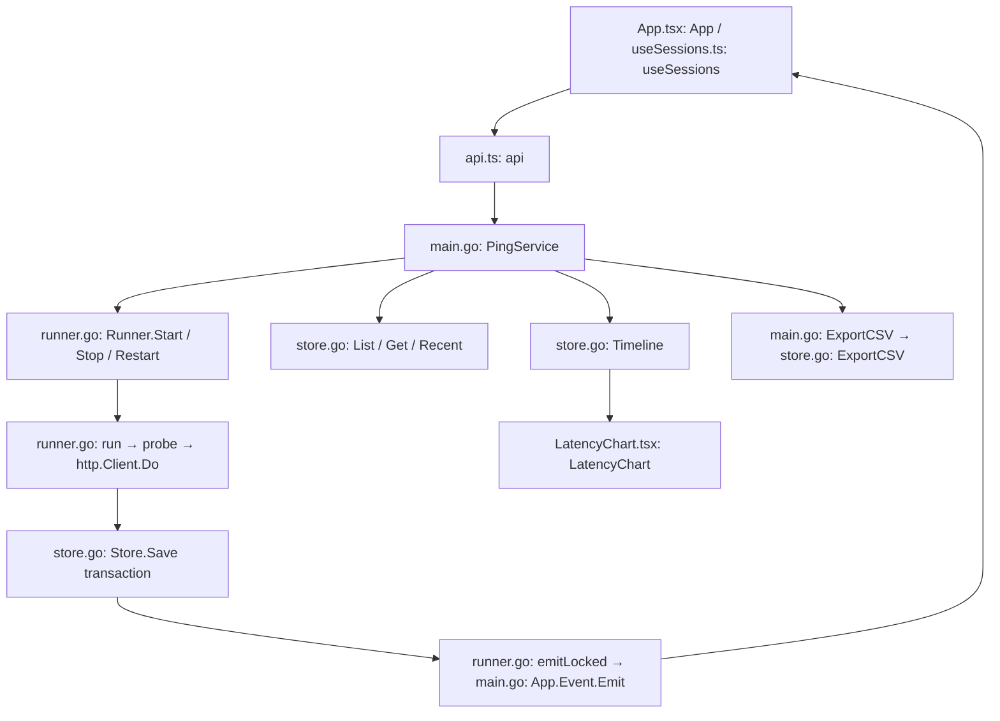

# Wails HTTP desktop foundation

The independent `wails-http/` module is the first production migration milestone: HTTP testing, automatic persistence, saved History, full-timeline graphs, and CSV export. The root Fyne application and its database are unchanged. Wails starts with a fresh database; no legacy import or schema compatibility is intended.

## Run and build

Requirements: Go 1.25+, Node 24 LTS (or another version supported by the locked Vite release), npm, and the native dependencies for Wails v3.0.0-beta.17. The Go and JavaScript Wails versions are pinned together. This remains a preview on a beta framework.

From `wails-http/`:

```sh
make setup
make run
# macOS application bundle:
make mac-app
```

The frontend must be built before Go because `main.go` embeds `frontend/dist`. The source `frontend/index.html` cannot run the desktop backend when opened as a file. `npm --prefix frontend run dev` starts only the frontend.

`Makefile` matches macOS C compiler and linker deployment targets at 11.0. This is a build setting, not a claim that older macOS versions have been runtime tested. The unsigned bundle has its own identifier, `net.packetstreams.ntgui.wails`.

`.github/workflows/wails-http.yml` defines native builds and race tests on macOS, Windows, and Ubuntu 24.04. Linux uses GTK4/WebKitGTK 6.0. Windows needs WebView2 at runtime. CI execution and interactive Windows/Linux tests require those environments; adding the workflow does not establish that they have passed. Signing and installers are a later milestone.

## Storage and lifecycle

`internal/ping/store.go: DefaultStorePath` resolves `os.UserConfigDir()/nt-wails/results.db` on each OS. A development-only `NT_WAILS_DATA_DIR` environment override can isolate smoke tests. This never discovers or opens Fyne's `ntdata.db`.

`application.New` acquires the Wails single-instance identity before opening storage. A second launch focuses the main window. `OpenStore` creates schema version 1 and rejects newer versions. SQLite uses WAL, foreign keys, a one-second busy timeout, FULL synchronous commits, and one connection. Newly created database files have mode 0600 and new directories mode 0700 where supported by the OS.

- `tests`: configuration, lifecycle, and statistics in sanitized JSON, with indexed running state.
- `samples`: original sample JSON, sequence primary key `(test_id, seq)`, and indexed `(test_id, time, seq)` access.
- `buckets`: incrementally maintained radix-4 summaries, indexed by test, level, and bucket. These retain first/last, successful min/max, a failure representative, and exact counts/sums. Twenty levels cover practical long-duration runs; the raw sample table has no retention cutoff.

Every completed probe commits its sample, statistics, and summaries in one transaction before emitting a UI event. There is no asynchronous unsaved queue. The worker stops and reports an explicit saving error if a transaction fails; it does not report that sample as saved. The current save error also stays in runtime state if the database cannot record it. Persisted results remain until explicit deletion.

Normal shutdown cancels all workers, records stopped states, waits for workers, and closes storage. Reopening restores history without sending requests. Any previously running records are marked interrupted with their last saved probe as the interruption boundary. No claim is made about an uncommitted, in-flight request surviving a crash.

Active tests are capped at 8. Historical tests are not capped at 24: history uses pages of 50 and a row-ID cursor. Go retains active/current session metadata, not every probe in memory. React holds one page, selected metadata, six recent probes, and the displayed timeline summary.

## HTTP semantics

- HTTPS is the default scheme. The form accepts a host/path without a scheme and also handles pasted complete URLs.
- GET, PUT, PATCH; PUT/PATCH send no body. Requests use fresh connections and measure time to response headers. Redirects are not followed.
- Configurable interval (1–60 seconds), timeout (1–30 seconds), expected status groups/exact codes, and optional authenticated HTTP/HTTPS proxy.
- Default accepted statuses are 2xx and 3xx. Latency min/max/average include successful probes only. Explicit stop cancellation is not a failed probe.
- Normal system certificate verification remains enabled for targets and proxies. The independent adapter remains necessary because the existing nt dependency's HTTP implementation lacks caller context cancellation and disables TLS verification.
- Proxy passwords are never returned in session snapshots or saved in SQLite. A saved password-required flag makes Run again request the credential. No OS credential store is introduced.

## Interface and timeline

The dark blue form, Advanced options, whole-row selection, metrics, recent probes, and detached chart windows are retained. History offers URL search, status filters, page navigation, replay, and confirmed permanent deletion. Deletion cascades to raw samples and summaries and closes a matching chart window.

`LatencyChart` requests a timestamp range from `PingService.Timeline`. Full mode follows the test start through now (or its stopped boundary). Moving a handle fixes a historical range; Reset restores the full range and resumes live following. Pause freezes the chart's time boundary while probes and saving continue. The zoom controls remain available for empty periods. Obsolete asynchronous responses are ignored when ranges change.

`Store.Timeline` finds range bounds through the time index, decomposes the corresponding sequence interval into aligned summary buckets and exact edge samples, and returns exact visible counts/average/max with representative points. It does not transfer or scan the entire history for every update. Dense views are labelled as overviews; zoom reveals individual probes. Hover describes an actual displayed raw representative, not a synthetic averaged probe. Timestamps are expected to follow collection order; abrupt backward system-clock changes need additional handling before a general production release.

`Store.ExportCSV` reads original samples in pages of 256 to a fixed sequence watermark. Exports include all saved probes through that watermark, regardless of chart zoom or pause. `PingService.ExportCSV` uses a native save dialog, writes/syncs a temporary file in the destination directory, and renames it only after success. Failed exports clean up their temporary file. Export of a running test is a snapshot and does not include later probes.

## Architecture



The desktop bridge uses typed local `Call.ByName` wrappers. Generated bindings and a shared multi-protocol session abstraction can follow when other protocols are added. No REST control server or new frontend framework is introduced.

## Validation and remaining work

```sh
go test -race ./internal/ping
npm --prefix frontend run build
make mac-app
```

Tests cover HTTP methods/statuses/proxy redaction, cancellation, TLS rejection, saving failure and atomic rollback, recovery of 4,200 probes, exact range statistics and preserved latency peaks, uncapped historical sessions/pagination, complete CSV ordering, export errors, cascade deletion, normal shutdown, and unsupported schema versions.

Verified locally: frontend build, race tests (4,200 saved probes and 125 historical sessions), macOS build without deployment-target warnings, and Windows amd64 cross-compilation. The native macOS smoke test confirmed pause with continued saving, CSV export, both zoom handles/reset, separate replay, quit/reopen with two restored stopped sessions, selection from a non-URL cell, visible metric cards, and deletion confirmation/cancellation. The workflow has not been run remotely.

Remaining phases: native Windows/Linux interactive verification; long soak and million-sample performance testing; TCP/DNS/ICMP adapters; CSV import/Result Analysis; settings; signing/installers and release QA. No Fyne history migration is planned. There is no automatic disk cleanup: storage errors stop the affected test visibly. Large exports stream but do not yet have an application-level progress/cancel control.
